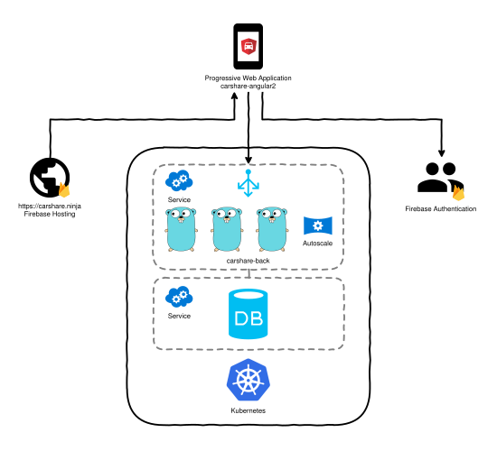

#HSLIDE

# carshare.ninja

#HSLIDE

## What is carshare.ninja

- Tracks of who does what in a car share <!-- .element: class="fragment" data-fragment-index="1" -->
- Suggests who should drive next <!-- .element: class="fragment" data-fragment-index="2" -->
- Driven by a flexible and fair scoring algorithm <!-- .element: class="fragment" data-fragment-index="3" -->
- Accessible via Progressive Web Application <!-- .element: class="fragment" data-fragment-index="4" -->
  - Reliable - loads instantly even with unreliable network
  - Fast - won't leave you hanging, you've got somewhere to go!
  - Engaging - feels like a native app

#VSLIDE

## Member Scoring System

`$$Score = \frac{DistanceAsPassenger}{DistanceAsDriver}$$`

Members with the lowest score should drive next <!-- .element: class="fragment" data-fragment-index="2" -->

#VSLIDE

Ranking members by the benefit they personally recieve keeps things simple and fair.

#VSLIDE

Offers great flexibility.<!-- .element: class="fragment" data-fragment-index="1" --> Can handle: <!-- .element: class="fragment" data-fragment-index="2" -->

- holidays <!-- .element: class="fragment" data-fragment-index="2" -->
- sick days <!-- .element: class="fragment" data-fragment-index="3" -->
- differing shift patterns <!-- .element: class="fragment" data-fragment-index="4" -->
- differing distances. Maybe you pick a member up on the way? <!-- .element: class="fragment" data-fragment-index="5" -->

#HSLIDE

# Technical Overview

#VSLIDE

## API

- Stateless microservice written Go  <!-- .element: class="fragment" data-fragment-index="1" -->
- To be deployed as an autoscaling service in Kubernetes <!-- .element: class="fragment" data-fragment-index="2" -->
- Authentication via Firebase JWT tokens <!-- .element: class="fragment" data-fragment-index="3" -->
  - I created library for this called [firebase-jwt-auth](https://github.com/LewisWatson/firebase-jwt-auth)
- RESTful and conforms to JSON:API specifications <!-- .element: class="fragment" data-fragment-index="5" -->
- Scalable data persistance via MongoDB <!-- .element: class="fragment" data-fragment-index="6" -->

#VSLIDE

## Front End

- Written in Angular2  <!-- .element: class="fragment" data-fragment-index="1" -->
- Material design <!-- .element: class="fragment" data-fragment-index="2" -->
- Progressive Web Application <!-- .element: class="fragment" data-fragment-index="3" -->
  - Open Web
  - Service workers
  - Offline first
- Firebase authentication <!-- .element: class="fragment" data-fragment-index="4" -->
  - Username/Password, social, anonymous 
  - JWT token included with every API call

#VSLIDE

#HSLIDE

# Current State

#VSLIDE

## API

- Majority of REST endpoints implemented
- Integrates with MongoDB
- Docker image
- Able to verify Firebase JWT Tokens
- TODO <!-- .element: class="fragment" data-fragment-index="1" -->
  - Currently restricting access based on JWT
  - Need to figure out where to host it

#VSLIDE

## Front End

- Implemented some of the key screens
- Firebase anonymous authentication.
  - JWT included in every API call
- PWA features mostly implemented, still need to tackle offline first
- Hosted on Firebase.
- HTTPS certificate provided by LetsEncrypt
- TODO <!-- .element: class="fragment" data-fragment-index="1" -->
  - Still need to implement the full set of screens
  - Add more authentication providers

#HSLIDE

## One More Thing...

#VSLIDE

#### Early Preview Available @

[https://carshare.ninja](https://carshare.ninja)

#HSLIDE

FIN
